Writing this up as I work so you can see into my thinking style as well as so I can give credit to libraries and such where due.

# Thought Process

## Research Phase

I started by riffing off some ideas with ChatGPT to explore the problem space, and what kinds of things have already been solved for and what hasn't yet. This includes making use of libraries like

- https://cortexjs.io/mathlive/virtual-keyboard/
- https://konvajs.org/

From there, I then used some good ol Pen and Paper to map out what I think a v0 could look like. At a high level, I'm picturing a way to gamify this process by making it feel like an arcade game of sorts, where you log in with a username, see what other contracters have done, and then start a game session accordingly. You have to be careful here though because this can lead to people overoptimizing for the wrong metric. Future thought though.

To fact check myself on what other companies use / what solutions are out there, I tried to look for a few other image annotation softwares to get a sense of their demos:

- https://www.superannotate.com/image-annotation-tool
- https://www.robots.ox.ac.uk/~vgg/software/via/via_demo.html
- https://app.cvat.ai/

One thing I noticed from these is the ability to use keyboard shortcuts, undo, on the images. They were also all set up in a very Adobe Photoshop type way. I think this is potentially overkill for whiteboards, so I will take inspiration but likely opt for something simpler for the sake of this assignment.

| CVAT              | Oxford                |
| ----------------- | --------------------- |
| 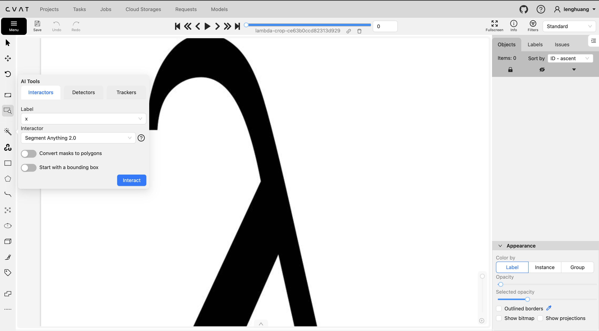 | 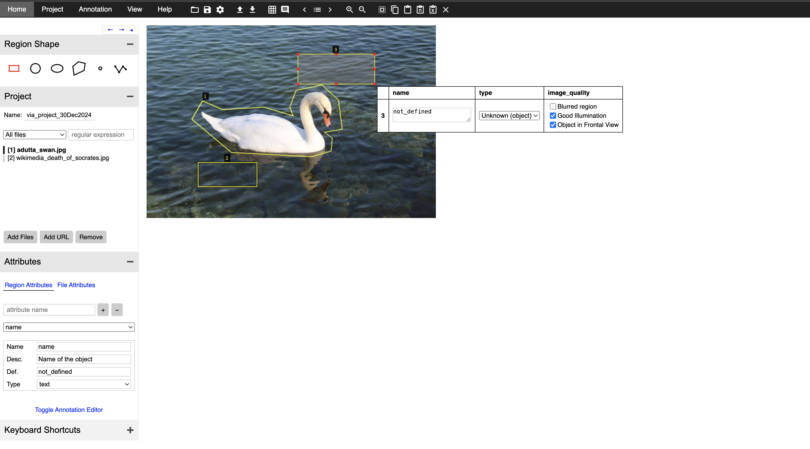 |

## Ideation Phase

I drew out a few ways for what I think this could look like. I'm imagining a very fluid multi-step flow, in a Duolingo-esque way, making sure to give space for contractors to pause and think about what they did, allowing them to edit if necessary but also proceed quickly.

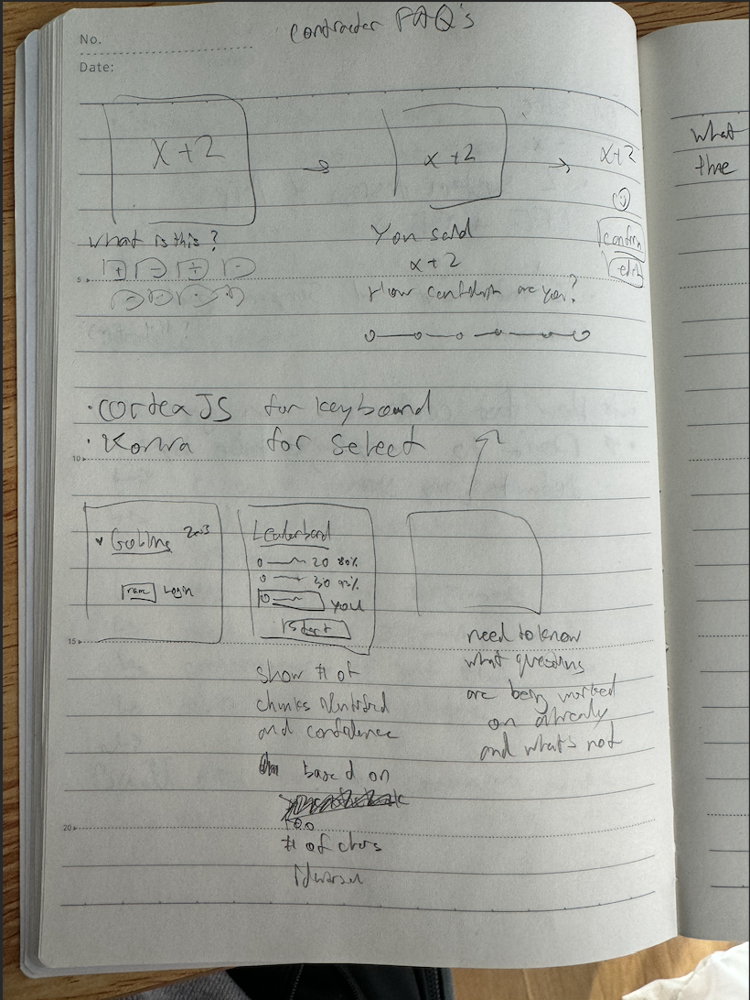

For the sake of persisting data easily between different users and contractors, I initially decided to just go with Firebase and Next.js, since those are things I've used before and I'm just trying to get a proof of concept out. To do that I followed this and took their end state repo directly and made changes to it:

- https://firebase.google.com/codelabs/firebase-nextjs#0
- https://github.com/firebase/friendlyeats-web/tree/master/nextjs-end

Here, I realized that Next may be overkill for this simple app (or I got scared of paying for a billing plan haha) so I looked towards using Vite instead (https://www.youtube.com/watch?v=1MlVEWX8q8c).

Then it got hard to do all the configuration myself so I opted for this instead: https://github.com/TeXmeijin/vite-react-ts-tailwind-firebase-starter/blob/main/README.md

With this, I was able to start to get some things going. There were some things that I didn't like, for example on every page change, the navbar would reload a little due to firebase auth loading every time. Additionally, it would have been nice if there were some unit tests, storybook, and more to make it better for multiple people to work on. However, this started pack felt "good enough" so I decided it was more important to get something working at this state and to just stick with it.

In an ideal scenario, I would have used Supabase since it's generally more popular now, meaning better online support (tutorials, forums, better features, etc). However, I was already at my two project maximum on my Hobby Plan, so I sought alternatives. Also, Firebase was a familiar tool so I figured it would be a little quicker.

## Setting Up The Barebones

I started just writing code and worrying about mainly just getting something working first above all. To ensure everything worked end to end (somewhat), I got a skeleton going of all the different pages I needed, set up firebase authentication with email and password. It is arguably easier to do "Sign In With Google", because I wouldn't have to code my own UI for it. It is also what the starter code sets you up with. However, I opted for email and password, since for these contractors, it's possible that they don't have a Google email. Especially since this isn't really something tied to personal use, and more so work, they may not want to use a personal Google email for this.

After I set up authentication and the barebones for a few different pages, I set up the deploy for my code, to make sure that this tech stack could get me a live product. There were some hiccups with folder organization and what not, but I got it to work:

- https://lenhuang-goblinsapp.web.app/
- https://lenhuang-goblinsapp.firebaseapp.com/

This is what it looked like at this point.

## Starting Off With One

After this, to not over commit, I decided to "practice" integrating the image selection / cropping UI with just one example image. I was thinking it could make sense to have it be a query param with a specific image's ID stored. I thought of this because I was thinking what it would look like if you had like a few contractors working at the same time, and how best to avoid duplicated effort.

However, I figured that this was a design choice I could probably make later since I needed to solve the singleton case before worrying about multiple users and concurrency haha, so I just went with it for now. First, I put some dummy data just so I could mock up what the front end might expect.

| Jobs                   | Chunks                    |
| ---------------------- | ------------------------- |
| 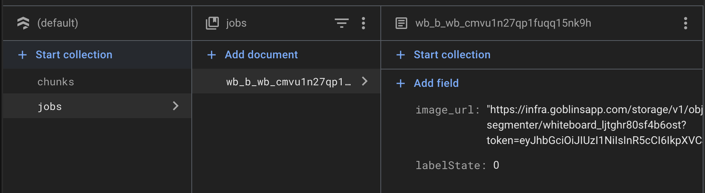 | 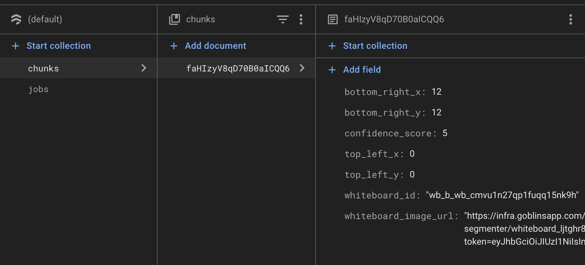 |

Ideally, I would have done this with firestore's emulator capability. However, I ran into issues with emulators while I was doing Auth due to some race conditions with how the app was initialized. Since I could get around this by just using the "prod" data, I decided to do so. I would not have done this in a real world scenario. The emulator is quite nice because it allows you to have a sandbox environment. Either that or I would set up two firebase projects to have a QA / Prod one. After a bit of tweaking, and introducing `react-query` to have some nicer loading states and query handling, I was able to get a proof of concept of my database showing one row of data.

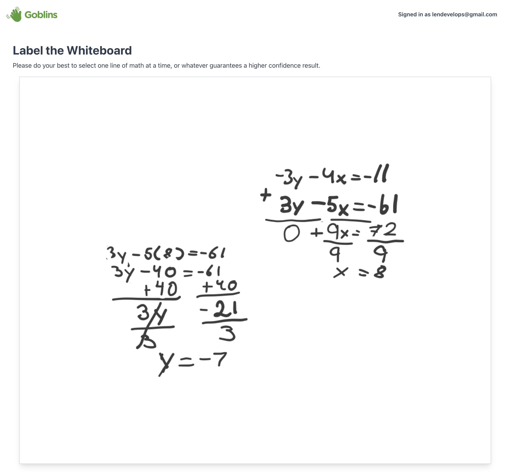

## Doing More Research Into Graphics Packages

Earlier I said I would use `KonvaJs` to handle the bounding box / annotation problem. I'm doing a gut check here to see if that's still the right thing to do. I'm considering a few alternatives, and also wondering what the end usage is. If we have to pass this into an ML model, I could see it being more efficient to handle storage of chunk images on our side. Namely, we could crop the image according to the bounding box and then upload it to our own bucket storage, and then pass that URL as the chunk_image URL. This could be much more flexible than storing something like `top_left_x` and all the other coordinates individually. In the future, this could hypothetically allow polygon shapes as bounding boxes. This will make it easier for whatever Python ML code we're running to avoid making a bunch of transformations with `PIL` or something that may not work.

- https://fabricjs.com/demos/
- https://universaldatatool.github.io/react-image-annotate/demo/
- https://github.com/embiem/react-canvas-draw
- https://www.npmjs.com/package/react-image-crop
- https://pqina.nl/pintura/?ref=react-image-crop

Additionally, I started wondering if it's necessary for contractors to be able to rotate shapes. For example, what if a student gets the answer right, but for some reason was writing sideways, with rotation lock on? Should we allow that? I would wager no, to make sure our model is more accurate even if for less use cases. Additionally, looking through some of these images, I can see that there are some scenarios where text is really close to each other. I would like to be able to, after selecting a bounding box, "clean it up" a bit, so that it's straightened and there's not noise from surrounding data.

I'm now imagining a flow where you select all your boxes, then go through and clean each one of them up and label them, like a game.

I decided to follow the example of https://github.com/sekoyo/react-image-crop?tab=readme-ov-file#how-can-i-generate-a-crop-preview-in-the-browser. It seemed decently light-weight, and I didn't think I needed the fancy features of a full-fledged image editor. After some copy-paste and some debugging, we end up with the following:

| Barely Working                  | A Bit Better                    |
| ------------------------------- | ------------------------------- |
| 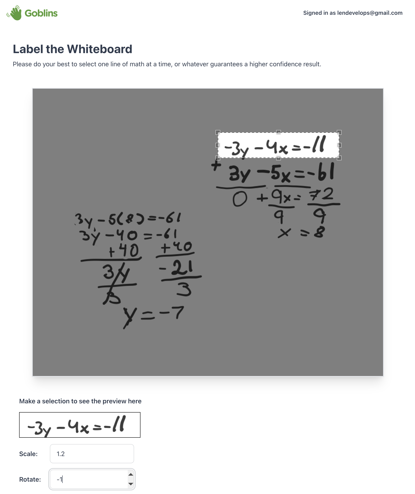 | 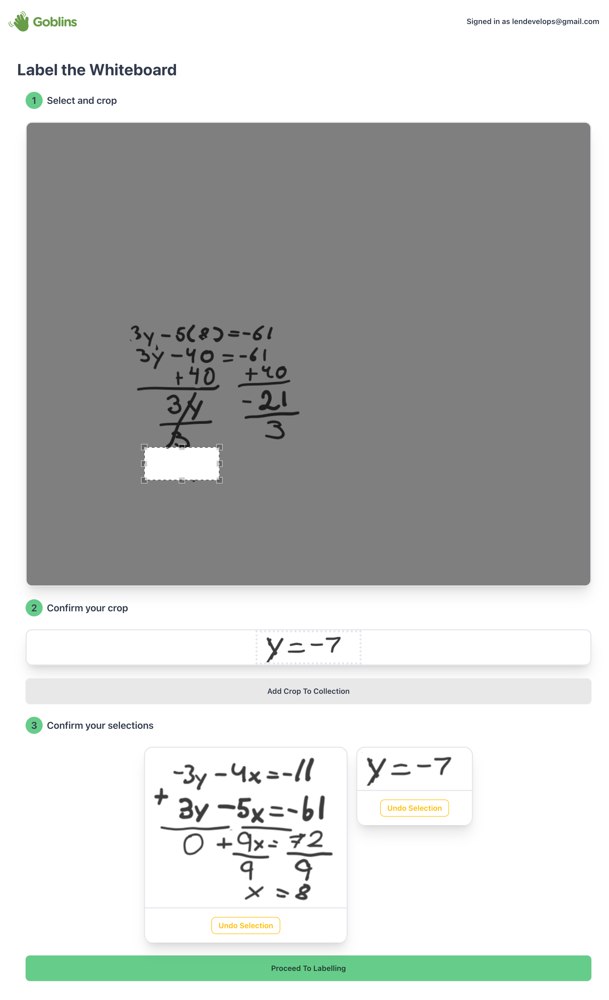 |

Despite what I said earlier, I don't think I'm going to account for rotation and scaling. The coordinate math became a bit of a headache, and I'm sure I could tackle it with a clear mind, but I decided that it was more important to get the project functioning end to end than to dwell on that.

Progress Until This Point: https://github.com/lenghuang/goblins-take-home/pull/1

I then took some time to hash out some bugs, spruce up the UI, and fix some data consistency issues. https://github.com/lenghuang/goblins-take-home/pull/2

Both these PR's contain failr descriptive gifs.

## Adding Math Keyboard

I have a few ideas for how to improve the cropping experience, like being able to undo, and more. But for now, a user can refresh if they mess up, and can keep track of what they've cropped so far both because we white it out and because we show them a gallery of cards. While the UI can be improved, I'm gonna keep powering on and now add a math keyboard for people to input formulas into.

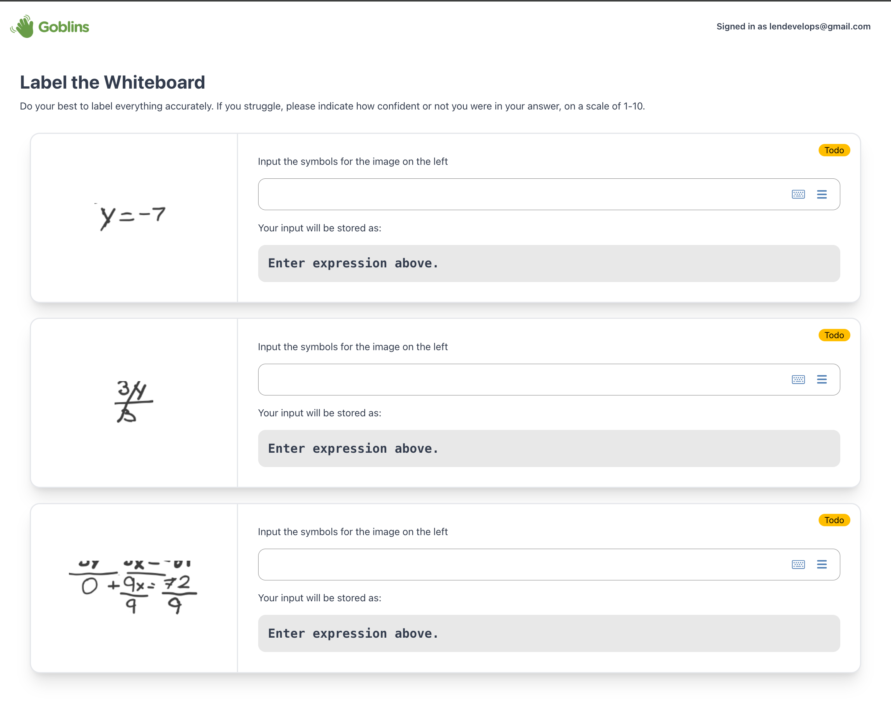

I quickly whipped together that shows at once for all of the possible chunks associated with a whiteboard. While there are improvements that could be made with the UI, I felt that this was good enough for now and was something I could revisit in the future. The biggest slowdown I could see at this page would be unfamiliar math expressions, like `\cancel{}`, so I would want to add a few buttons that contractors could use as short cuts in the labelling process. This is something I'll do after I link the backend to everything. I think TailwindCSS has quite a nice example of docs that you can just search, so I would probably start with a cheat sheet that could be build out into its own set of docs in the future.

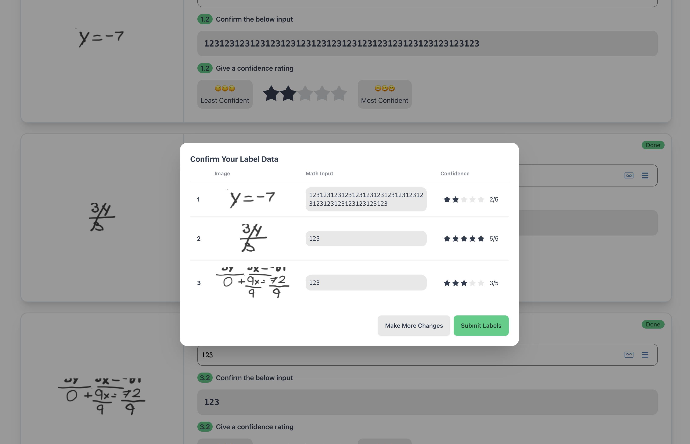

I was running into some issues with losing my data on refresh because of the HMR from vite, so I quickly added some session storage capabilities. This will also help contractors who may refresh their screen for whatever reason (slow connection, etc). This was needed for me to begin working on the next step, which is persisting that data to the database.

Finally, I needed to implement the ability to store this data. Ideally, I would have put this into a blob storage source and then store the URL in my database. Right now, I am storing the base64 encoding of the entire image. This is really bad and doesn't scale well, but I decided to do this because I didn't want to put my credit card down for the pricing plan that would've given me access to the storage, so this is what I did for now.

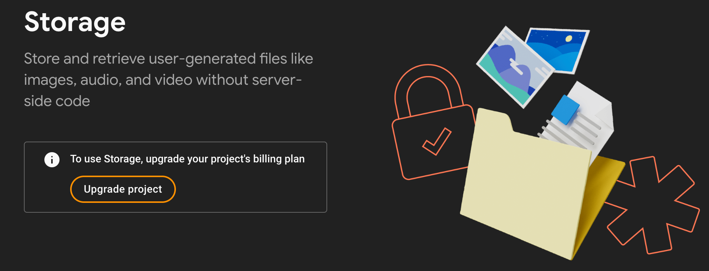

As I'm working on this, I've also come to realize that querying my data is not really efficient, and that it's probably not smart to delete whiteboards after you're done working with them. However, I wanted to save data and wanted to get this done quickly. If I had more time, I would need to think critically about how to aggregate this data efficiently for display (leaderboards, etc). There's a place of code where I query all data and then filter in memory in Javascript, which is not ideal but sufficient given the scale.

One thing I also realized is that it's pretty difficult to deal with multi-line math with this keyboard. Also, using LaTeX has a bit of a learning curve, so it may not be the most intuitive for every contractor. If I had more time, I would implement shortcuts, or have a view of commonly used math expressions to make it easier for them to label.

## Scaling to Multiple Whiteboards

At this point I was very in the zone and started forgetting to document some images as I went haha. But after I had the core functionality of labelling data done. Now, I needed to scale beyond just one whiteboard. First, I implemented a form to upload the original CSV and get all the data into Firestore. This was fairly straightforward fortunately.

With the data, I wanted a user to be able to pick a whiteboard to start working on. Here, I used pagination since it's possible there's lots of white boards to annotate. In an ideal world, it could be cool to do this in a Duolingo style, where images are automatically chosen for the contractor. This could also help avoid duplicated effort and concurrency issues. I decided it wasn't worth worrrying about that for now though since there won't be that many people using this. I opted for a gallery view with skeletons to allow users to go through and pick an image for them to load.

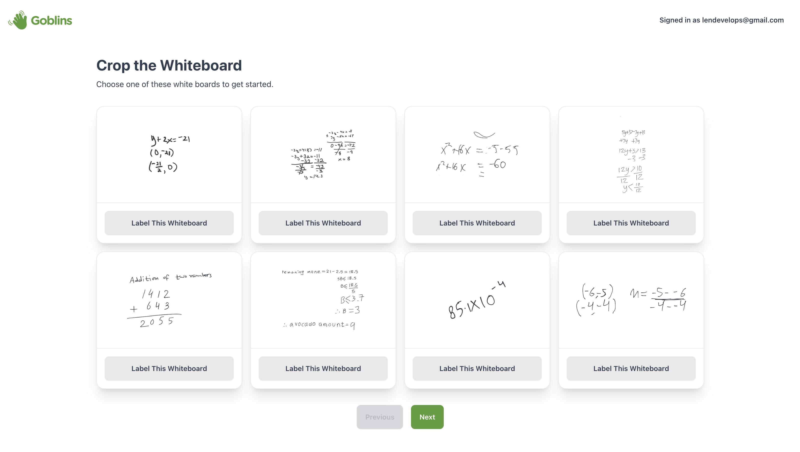

Here, I am loading the full whiteboard. Ideally, I would load these async as well and have some kind of CDN thing where the images would be optimized for a thumbnail view. Especialy cause these images could be pretty big, it would make the page pretty slow. After this was done, I moved some stuff around, got some edge cases handled, and considered this part done.

## Downloading the Data

Now with a way to upload data, as well as modify it, we needed a way to donwload all this data as well. Here, I wanted to demonstrate another form of pagination, and do it in a more "infinitely loading" kind of way. One thing I didn't do well with these queries is they're not cached super well, so there may be some full screen refreshes where there doesn't need to be. It took a while to get the pagination right, but it ended up being worth it I think for something like this. Ideally, this would be some automated job to our ML model or something like that. Or at least, we'd allow the user to select which rows they want to download and also delete some. But this can be done in the csv and in post-processing so it's not worth it for now.

## Reflections

Generally, I'm quite happy with how this turned out. There's lots of things that could have been done better and I'd say the frontend is probably a little stronger than the backend (though there's not much of a real backend). But I wrote this up to demonstrate that I was making certain tradeoffs intentionally.

Some things that I think I did well:

- Leveraging session storage
- Unique "whiting-out" cropping experience
- Overall UI Consistency
- General simplicity
- Form submission error handling

Some features that I would have liked to do that I didn't get to do were:

- Rotate and scale the image for cropping
- Leaderboard for contractors
- Personal statistics overview + badges
- Delete + edit view in the download labels page
- Better pagination UI
- Better concurrency handling between people editing at the same time
- Better data design choices (hard to aggregate data, query, etc)
